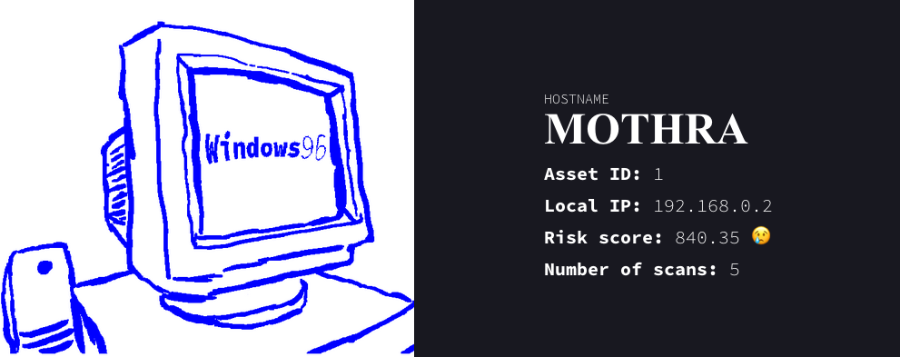

<pre>
    <code>
    ██████╗ ██╗     ███████╗ █████╗ ███████╗███████╗    ██████╗  ██████╗ ███╗   ██╗████████╗    
    ██╔══██╗██║     ██╔════╝██╔══██╗██╔════╝██╔════╝    ██╔══██╗██╔═══██╗████╗  ██║╚══██╔══╝    
    ██████╔╝██║     █████╗  ███████║███████╗█████╗      ██║  ██║██║   ██║██╔██╗ ██║   ██║       
    ██╔═══╝ ██║     ██╔══╝  ██╔══██║╚════██║██╔══╝      ██║  ██║██║   ██║██║╚██╗██║   ██║       
    ██║     ███████╗███████╗██║  ██║███████║███████╗    ██████╔╝╚██████╔╝██║ ╚████║   ██║       
    ╚═╝     ╚══════╝╚══════╝╚═╝  ╚═╝╚══════╝╚══════╝    ╚═════╝  ╚═════╝ ╚═╝  ╚═══╝   ╚═╝       
                                                                                                
    ██╗  ██╗ █████╗  ██████╗██╗  ██╗    ███╗   ███╗███████╗██╗                                  
    ██║  ██║██╔══██╗██╔════╝██║ ██╔╝    ████╗ ████║██╔════╝██║                                  
    ███████║███████║██║     █████╔╝     ██╔████╔██║█████╗  ██║                                  
    ██╔══██║██╔══██║██║     ██╔═██╗     ██║╚██╔╝██║██╔══╝  ╚═╝                                  
    ██║  ██║██║  ██║╚██████╗██║  ██╗    ██║ ╚═╝ ██║███████╗██╗                                  
    ╚═╝  ╚═╝╚═╝  ╚═╝ ╚═════╝╚═╝  ╚═╝    ╚═╝     ╚═╝╚══════╝╚═╝
    </code>
</pre>

# Check it out
==> **https://haxx.gojira.dev**

# What is this?

I made this while playing around with the [InsightVM](https://www.rapid7.com/products/insightvm/) vuln scanner REST API. Just for fun!

It's a Next.js app. Since the API responses need to come from localhost, this page is just exported statically with no SSR. And, when my free trial runs out, it can (probably) never be compiled again! It's a limited-time event!
